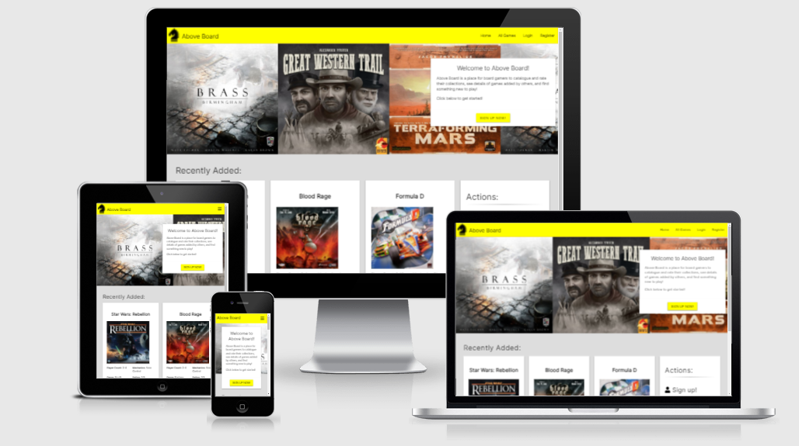
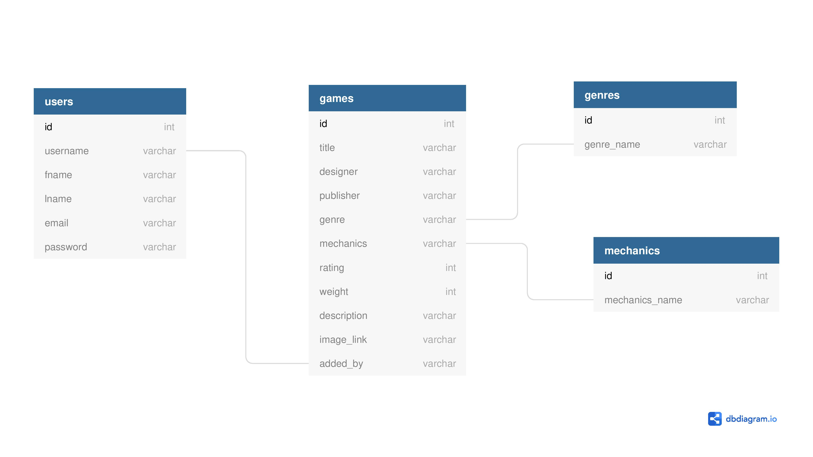
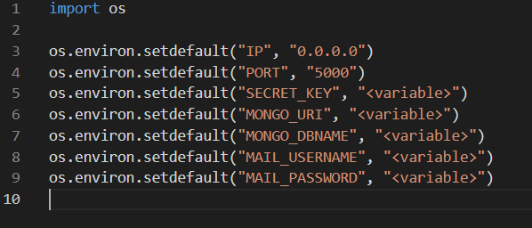

# Above Board

Above Board is a boardgame database that aims to provide boardgamers a place to catalogue, rate and research games.

View the live site [here](http://above-board.herokuapp.com/home).

# Table of Contents

> 1.  [Project Goals](#project-goals)
> 2.  [UX](#ux)
> 3.  [Features](#features)
> 4.  [Technologies Used](#technologies-used)
> 5.  [Testing](#testing)
> 6.  [Bugs](#bugs)
> 7.  [Deployment](#deployment)
> 8.  [Credits](#credits)
> 9.  [Acknowledgements](#acknowledgements)

# **Project Goals**

Above Board is a place for boardgame fans to browse an extensive database of games, add and rate games, and ultimately find something fun to play. Above Board is aimed at boardgamers new and old, allowing users to log their collections, rate games and explore the database by filtering by genre and game mechanics.

**User Goals:**

- A place to log their collection, see what games other people are playing, and find something to play.

**Site Owner Goal:**

- Utilize the site's functionality themselves.
- Promote boardgaming as a hobby.
- Potentially generate income via affiliate links.

*A screenshot of the Home page as viewed on different screen sizes, generated on [ami.responsivedesign.is](http://ami.responsivedesign.is/). An interactive scrollable version is available [here](http://ami.responsivedesign.is/?url=http://above-board.herokuapp.com/home).*

# **UX**

## **User Stories**

1. As a new user, I want to be able to register an account, so I can fully utilize the site.
2. As a returning user, I want to be able to log in easily, so I can access the site’s features.
3. As a boardgame fan, I want to be able to view, search and filter a database of games, so I can find one to play.
4. As a boardgame fan, I want to add my games to the database, so I can curate my collection.
5. As a boardgame fan, I want to view my collection of games to the database, so I can see all the games I have added.
6. As a boardgame fan, I want rate games in the database, so I can provide guidance to other users.
7. As a site user, I want to be able to delete my posts, so I can remove any games I have posted.
8. As a site administrator, I want to be able to delete any user’s games, so I can remove any potentially inappropriate content.
9. As a site administrator, I want to be able to add new genres and mechanics, so I can expand the database content in line with user demands.

## **Design**

### Database Schema

Based on the above, the following schema was mapped out:

### Initial Wireframes

Based on the above, the following wireframes were mocked up:

- [Index](docs/wireframes/index.pdf)
- [Login](docs/wireframes/login.pdf)
- [Register](docs/wireframes/register.pdf)
- [Profile Page](docs/wireframes/profile.pdf)
- [All Games & My Games](docs/wireframes/all-games.pdf) 
- [Add Game & Edit Game](docs/wireframes/add-game.pdf) 
- [View Game](docs/wireframes/game-info.pdf)
- [Admin Area](docs/wireframes/admin-area.pdf)

### Colour Scheme

The color palette chosen for this project is below.

- The yellow was chosen for the navigation bar and some UI elements, as it is warm and bright and can quickly grab the users attention. Care was given to not overuse it, as it could lead to visual fatigue.
- The greys and lilac were chosen as background colors as they are muted and would not divert the users attention away from the content of the site.
- Black font is used throughout the site, to ensure readability. The contrast of the black text against the various background colors was checked with this [contrast checker](https://coolors.co/contrast-checker/000000-ffff00).

### Fonts

The fonts chosen for this project were:
1. [Scramble](https://www.fontspace.com/scramble-font-f2476)
2. [Inter](https://fonts.google.com/?query=inter)

#### Scramble

Scramble was chosen as the font for the main headers of the site. This font was chosen as visual reference to the boardgame 'Scrabble', with which many of the users of the site would already be familiar, in the hopes of eliciting a positive emotional response from them.

#### Inter

Inter is a a variable font family specifically designed to be legible on computer screens. This font was chosen to prioritize readability, particularly when database entries could have variable amounts of text.

# Features

## Existing Features
The features of the site can be broadly divide into three groups; User features, Game features and Miscellaneous (Misc) features.

### Users

Users of the site are able to register accounts, log in and out, edit their account info and reset their password via email.

#### Users - Register
- Users can register for an account using the form on the Register page, which can be accessed via the navigation bar at any time, or via the prominent call to action button on the homepage.
- Users must provide their first and last names, their desired usernames, their emails and a secure password.
- This form, created with `flask-wtforms`, has extensive validation checks that ensure the password provided is sufficiently secure, and the username and email do not already exist in the database. If there are any issues, this is fed back to the user on the front-end and the form is not submitted.
- Upon successfully submitting and validating the form, the user's account is registered to the database and they are invited to log in.

#### Users - Login/Logout
- Once a user has an account, they can log in. This is accessed via the navigation bar, or if a user attempts to reach a page they can only access while logged in.
- To login, a user must provide an email address and a password. This is compared against the email in the database and the secure hash of the password. Passwords are never stored as plaintext.
- If the information does not match, the user is given feedback and encouraged to try again.
- If the information matches, `flask-login` is used to log the user in.
- A logged in user can log out at any time by clicking the relevant link in the navigation bar.

#### Users - Edit Account Info
- While logged in a user can navigate to their Profile page, where they can see and edit their account information.
- Users can update their first and last names, and their email address.
- Users cannot change their usernames as these are essential to the site's functionality.

#### Users - Password Reset
- When logging in, a user who has forgotten their password can requesta password reset.
- The user is asked to provide the email address associated with the account, and provided it exists in the database an email is sent to this address.
- This email contains a link, the URL of which is created with a secure token unique to that account. Following that link will allow the user to set a new password. The token will expire if not used in time.
- A user who did not request a reset, or changes their mind, can safely ignore the email. 

### Games

Users of the site can view and search all games in the database, and can add, edit, delete and rate games.

#### Games - View & Search Games
- Users, regardless of whether they are logged in or not, can see the three most recent additions to the database on the home page.
- Additonally, all users may view the All Games page.
- This page displays all the games in the database, alphabetized and paginated to show 8 results per page.
- Users can navigate between the pages of results using the controls at the bottom of the screen.
- Using the search bar in the top rightof the page, users can search the database for their inputted term using mongoDB's text index, which will return only the games that match. The search can be reset using the red Reset button by the input.
- By clicking on any of the games displayed on the All Games page, a user will be brought to that game's page.
- This page will provide more in depth information about the game, the game's current average rating, and a link to search for the game on Amazon.
- In the top left, there will be a red 'Back' button. This button uses the `request.referrer` to send the user back to the page they came from, so if browsing through paginated results they will be returned to the correct page.
- Depending on whether the user is logged in at this point, and if they originally added the game, they may see more options to rate, edit and delete the game. More on this below.
- A logged in user can also navigate to their My Games page, which is laid out identically tot he All Games page (complete with the search functionality) but will only return the games that have been added by the current user.

#### Games  - Add Games
- When a user is logged in, they may add games to the database.
- This can be accessed by clicking the labelled buttons on the Home page, Profile page and All & My Games pages.
- Users are then brought to a form where they can provide information about the game they would like to add.
- The form asks the users to provided details about the game (Title, Designer, Publisher, etc) along with a link to the box art and a short description.
- The form will attempt to use `urllib` to validate that the link provided is a valid URL pointing to a JPEG or JPG file.
- However, the image link is not a required field, and if left blank will instead be populated with [this](https://via.placeholder.com/250x200?text=No+Box+Art+Provided) placeholder box art.
- Upon successful completion of the form, the user is redirected to the All Games page where a message is flashed to inform them that the game has been successfully added.
- The user may then locate the game, either by searching or navigating the pages of results, and can clickon it to view the full details.

#### Games - Rate Games
- When a logged in user views a game's page, they wil see the games rating expressed as a number of stars, along with a number indicating how many times the game has been rated.
- The user will be able to interact with this star rating element, and will see it react as they drag their cursor across it.
- Clicking anywhere on the star rating will select the number of stars indicated and cause the 'Rate' button to appear.
- Clicking the rate button will submit the form, appending the user's rating to the list of ratings in the database.
- If the user were to navigate back to the game, they will see the number of ratings has incremented and the average rating may have changed.

#### Games - Edit & Delete
- When a logged in user views the page of a game they have added, they will see the buttons to Edit and Delete that game.
- Clicking Edit will bring them to the Edit Game page,which is a version of the Add Game form with the data pre-populated from the database. Users can change any of the information and submit the form to update the game's entry in the database.
- Clicking the Delete button will trigger a modal to pop up, advising the user that the deletion will be permanent and asking the user to confirm. If the user then clicks 'Delete', the game will be deleted. 

### Misc Features
These are features or aspects of the site's fucntionality that are not tied to the Users or Games features.

#### Misc - Responsive Navigation Bar
- The site features a responisve navigation bar adapted from MaterializeCSS

#### Misc - Return to Top Button
- The site features a custom return to top button.
- The button fades in on window scroll, and clicking will result ina smooth scroll back to the top of the page.
- A user that triggers the scroll accidentally can interrupt the animation by clicking/tapping or scrolling thier mousewheel.

#### Misc - Error Handling
- The site has custom 404 and 500 error pages that will display to users should somehtign go wrong.
- These pages include the full navigation bar, which will allow users to navigate back to safety.

## Features To Be Implemented
- A social media style functionality, where users can view each others collections.

# Technologies Used

- HTML5 - the pages of this site were designed using HTML.
- CSS3 - the pages of this site were styled using CSS.
- JavaScript - the interactive elements of this site were implemented using JavaScript.
- Python - back-end functionality of the site was written in Python
- [Flask](https://flask.palletsprojects.com/en/2.0.x/#) - The Flask micro-framework - including the [Jinja](https://jinja.palletsprojects.com/) template engine and [Werkzeug](https://werkzeug.palletsprojects.com/) toolkit - was used to develop this site.
- [MongoDB](https://www.mongodb.com/) - the site's uses MongoDB as it's database platform.
- [Gitpod](https://www.gitpod.io/) - the site was developed using Gitpod as the development environment.
- [Materialize](https://materializecss.com/) - the site was styled using the Materialize front-end framework.
- [jQuery](https://jquery.com/) - jQuery was used to simplify and condense JavaScript, particularly for interacting with, and writing to, the DOM.
- [Font Awesome](https://fontawesome.com/) - Font Awesome icons were used for the social media links in the footer.
- [Google Fonts](https://fonts.google.com/) - Google Fonts were used throughout the project.
- [Coolor Contrast Checker](https://coolors.co/contrast-checker/000000-ffff00) - Contrast Checker was used to ensure there was sufficient contrast between foreground and background colours.
- [Free Logo Design](https://www.freelogodesign.org/) - The site's brand logo was created using Free Logo Design.
- [Favicon Generator](https://www.favicongenerator.com/) - Favicon Generator was used to create and size the favicon for the site, using the logo created above.
- [Random Keygen](https://randomkeygen.com/) - Used to generate the site's SECRET_KEY

## Packages
Some of the key packages used in this project include:
- [Flask-Login](https://flask-login.readthedocs.io/en/latest/) - Used to manage user logins, and for keeping track of the current user
- [Flask-WTForms](https://flask-wtf.readthedocs.io/en/0.15.x/) - Used to create and validate all forms in the project.
- [Flask-Mail](https://flask-mail.readthedocs.io/en/latest/) - Used to send the password reset email

*A full list of the packages can be found in the requirements.txt*

# Testing

*Full details of testing can be found [here](docs/TESTING.md).*

# Deployment

- This site was developed in [Gitpod](https://www.gitpod.io/), committed and pushed to [Github](https://github.com/), and deployed on [Heroku](https://www.heroku.com/).
- At the time of submission, there are no differences between the development version and deployed version of the site.

## The following steps were taken to deploy this site:
Initial steps:
1. Navigate to [Heroku](https://www.heroku.com/), and log in/sign up.
2. Once logged in, click on '**New**', and then '**Create New App**'.
3. Enter a suitable App Name, and choose the region from the dropdown menu.
4. Click on **Create App**.
5. Click on the '**Deploy**' tab.
6. Next to '**Deployment Method**', click on '**GitHub**'.
7. If prompted, enter GitHub login details.
8. Next to '**Connect to Github**', find the repository by typing the name in the search box.
9. Click '**Connect**'.

Enable Autmotaic deploys:
1. Within the Heroku app, navigate to the '**Deploy**' tab as above.
2. Navigate to '**Autmomatic deploys**', and select the branch fromwhich to deploy,in this case `main`.
3. Click '**Enable Automatic Deploys**'

Set Environment Variables:
1. Within the Heroku app, navigate to the '**Settings**' tab.
2. Click on '**Reveal Config Vars**'.
3. Add the following Config Variables:
    - **IP** : 0.0.0.0
    - **PORT** : 5000
    - **MONGO_URI** : The unique address of the mongoDB collection, which will include the database name and password. Can be found by logging in to [MongoDB](https://www.mongodb.com/), navigating to the Cluster in question and clicking on '**Connect**'.
    - **MONGO_DBNAME** : The name of the database on mongoDB
    - **SECRET_KEY** : A string of random characters, used by Flask to maintain security. Can be created using a key generator like the one above, [Random Keygen](https://randomkeygen.com/).
    - **MAIL_USERNAME** : The email address to be used to send email via Flask-Mail
    - **MAIL_PASSWORD**' : The app password for the email in the **MAIL_USERNAME**.

## To run and edit the code for this site locally, follow these steps:
* Log in to GitHub and navigate to the site's **[repository](https://github.com/kevinoc554/above-board)**.
* Click on the **Code** button.
* Copy the URL under **Clone with HTTPS** by clicking on the **Copy** button.
* Open the terminal in your IDE, and navigate to the desired directory.
* Type `git clone` into the terminal, and paste in the copied URL, e.g.,  
``git clone https://github.com/kevinoc554/above-board.git``
* Press enter to clone the repository.
* Create an `env.py` file to hold the Environment Variables, steps outlined below.
* Install the required packages using `pip install -r requirements.txt`.
* Enter `python run.py` to run the app locally.

Environment Variables:
- In order for the code to run locally, the Environment Variables must be set. These variables can be found by following the steps outlined above.
- Create a file named `env.py` at the root directory.
- Set the file up as follows:

- As these variables can contain passwords and secret keys, they should never be pushed to GitHub.

# Credits

## Code
- The [Python Flask Tutorial](https://coreyms.com/development/python/python-flask-tutorials-full-series) by [Corey M Schaffer](https://coreyms.com/) was referenced throught development, in particular for implementing the Reset Password Email functionality and refactoring the project into blueprints/app factory format.
- The front-end for the Star Rating system was adapted from [this](https://dev.to/inhuofficial/5-star-rating-system-actually-accessible-no-js-no-wai-aria-3idl) article on [dev.to](https://dev.to/) by [InHuOfficial](https://dev.to/inhuofficial).
- The site's pagination feature was based on [this](https://gist.github.com/mozillazg/69fb40067ae6d80386e10e105e6803c9) piece on GitHub, the previously mention Flask Tutorial and on previous discussion on the topic on Code Institute's Backend-dev Slack Channel. 

## Content
- The [Scramble](https://www.fontspace.com/scramble-font-f2476) font was used from [FontSpace](https://www.fontspace.com/) under their Shareware licence.

# Acknowledgements
I would like to thank Jack Wachira, and the Student Care team at Code Institute for their support during this project.